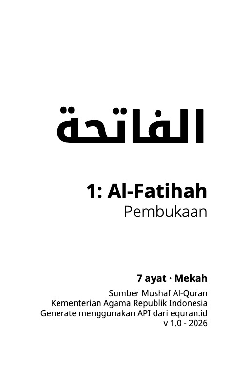
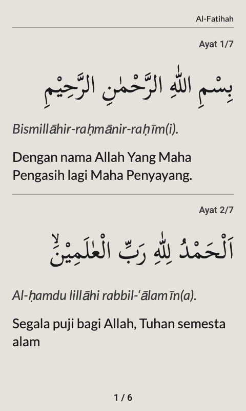
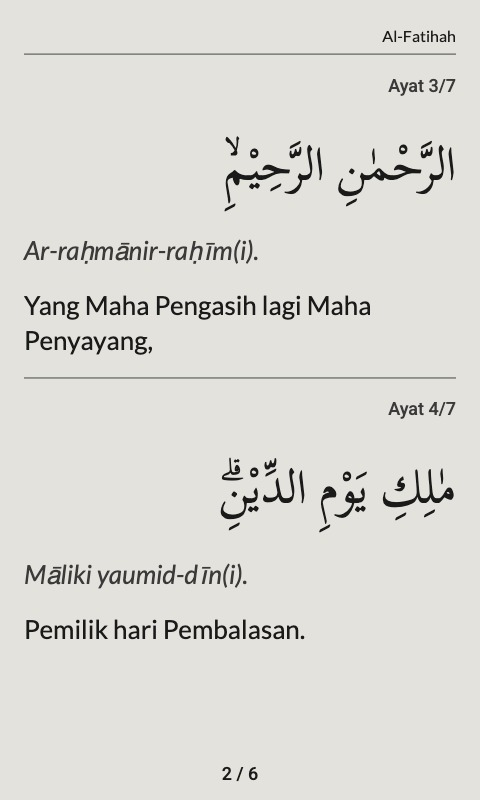
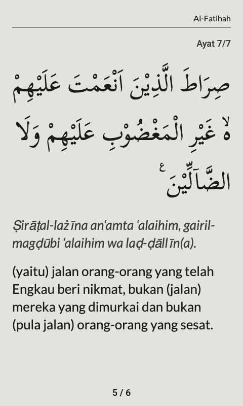

# Al-Qur'an Indonesia untuk Xteink X4 Pro

Koleksi **114 surah Al-Qur'an dalam format `.xtc`** yang disiapkan khusus untuk dibaca pada **Xteink X4 Pro**. Setiap surah dilengkapi dengan teks Arab, transliterasi Latin, terjemahan Bahasa Indonesia, nomor ayat, metadata surah, dan tata letak yang dioptimalkan untuk layar e-paper berukuran kecil.

Proyek ini dibuat karena masih sulit menemukan koleksi Al-Qur'an berformat `.xtc` yang memuat terjemahan Bahasa Indonesia dan nyaman dibaca pada Xteink X4 Pro. Seluruh 114 surah dibagikan **secara gratis**.

**[⬇ Unduh v1.0 — ZIP lengkap (55 MB) atau per surah](https://github.com/andidewanto/xteink-x4-quran-indonesia/releases/latest)**

> **Penting:** proyek ini bukan proyek resmi Xteink, EQuran.id, maupun Kementerian Agama Republik Indonesia.

## Pratinjau

Contoh: Surah Al-Fatihah, resolusi asli 480 × 800 px.

### Sampul surah

<p>
  
</p>

### Halaman isi

Setiap ayat memuat teks Arab, transliterasi Latin, dan terjemahan Bahasa Indonesia. Ayat pendek digabung dalam satu halaman; ayat panjang dipecah ke beberapa halaman.

<p>
  
  
  
</p>

### Penutup

<p>
  
</p>

## Cara Menggunakan

1. Buka halaman [**Releases**](https://github.com/andidewanto/xteink-x4-quran-indonesia/releases/latest), lalu unduh `xteink-x4-quran-indonesia-v1.0.zip` untuk semua surah, atau unduh file `.xtc` per surah dari daftar **Assets**.
2. (Opsional) Cocokkan checksum dengan `SHA256SUMS.txt`:
   ```bash
   shasum -a 256 -c --ignore-missing SHA256SUMS.txt
   ```
3. Jika mengunduh ZIP, ekstrak terlebih dahulu. Salin file `.xtc` yang diinginkan ke media penyimpanan yang dapat dibaca oleh Xteink X4 Pro.
4. Buka file tersebut dari perangkat Xteink X4 Pro.

Penamaan file menggunakan nomor tiga digit agar urutan surah tetap konsisten:

```text
001-Al-Fatihah.xtc
002-Al-Baqarah.xtc
003-Ali-Imran.xtc
...
114-An-Nas.xtc
```

## Sumber Data

Data Al-Qur'an diperoleh melalui **EQuran.id API v2**. Dokumentasi EQuran.id menyatakan bahwa sumber data Al-Qur'an yang digunakan adalah **Kementerian Agama Republik Indonesia**.

- EQuran.id API Hub: https://equran.id/apidev
- EQuran.id API v2: https://equran.id/apidev/v2
- Sumber data: Kementerian Agama Republik Indonesia

Atribusi yang disarankan saat membagikan ulang:

> Sumber data Al-Qur'an: EQuran.id (https://equran.id). Terjemahan Bahasa Indonesia: Kementerian Agama Republik Indonesia.

Detail atribusi tersedia pada [`ATTRIBUTION.md`](ATTRIBUTION.md).

# Pendekatan Pembuatan File `.xtc`

## 1. Permasalahan

Pada saat proyek ini dibuat, belum ditemukan koleksi Al-Qur'an Bahasa Indonesia berformat `.xtc` untuk Xteink X4 Pro yang sekaligus memuat teks Arab, transliterasi Latin, terjemahan Bahasa Indonesia, sumber data yang jelas, dan tata letak yang nyaman dibaca pada layar kecil.

Alih-alih mengonversi PDF atau dokumen yang sumber dan strukturnya sulit diverifikasi, pendekatan yang dipilih adalah **membangun file `.xtc` langsung dari data terstruktur melalui API**.

## 2. Alur Data

```text
EQuran.id API v2
        ↓
Pengambilan data surah
        ↓
Normalisasi data
        ↓
Penyusunan layout per ayat
        ↓
Pagination sesuai ukuran layar
        ↓
Preview halaman
        ↓
Export ke format .xtc
```

Data yang digunakan meliputi nomor surah, nama Latin, nama Arab, arti nama surah, jumlah ayat, tempat turun, teks Arab, transliterasi Latin, dan terjemahan Bahasa Indonesia.

## 3. Generator Berbasis Web

Generator dibuat sebagai halaman web agar proses penyusunan dan pemeriksaan visual dapat dilakukan dengan cepat. Antarmukanya terdiri dari daftar surah, informasi/metadata surah, dan preview halaman akhir sebelum diekspor.

Dengan pendekatan ini, setiap halaman dibentuk dari data ayat yang terstruktur, bukan dari konversi PDF atau gambar massal. Layout dapat disesuaikan langsung untuk karakteristik layar Xteink X4 Pro.

## 4. Prinsip Layout

Layout menggunakan kontras tinggi dan hierarki visual sederhana:

```text
Nama Surah
Nomor Ayat
Teks Arab
Transliterasi
Terjemahan Indonesia
```

Teks Arab memperoleh prioritas visual terbesar. Teks Arab, transliterasi, dan terjemahan dari satu ayat dipertahankan sebagai satu unit konten agar hubungan ketiganya mudah dipahami.

Pagination bersifat dinamis: ayat tidak dipaksa masuk ke jumlah halaman tertentu. Tinggi konten dihitung sesuai kebutuhan aktual sehingga ayat panjang tidak perlu diperkecil secara berlebihan.

Pemisah antarayat dibuat sederhana, dan setiap halaman menampilkan nomor halaman terhadap jumlah halaman dalam surah.

## 5. Sampul dan Penutup

Setiap surah diawali dengan sampul yang memuat nama surah dalam tulisan Arab, nomor dan nama surah, arti nama surah, jumlah ayat, tempat turun, sumber data, dan versi generator.

Setiap surah juga diakhiri dengan halaman penutup sederhana sebagai penanda bahwa surah telah selesai dibaca.

## 6. Pemeriksaan Hasil

Data sumber divalidasi secara otomatis sebelum export: 114 surah dengan total 6.236 ayat, sesuai metadata jumlah ayat per surah.

Sebelum export, setiap halaman diperiksa melalui preview untuk memastikan keterbacaan teks Arab, transliterasi, terjemahan, konsistensi layout, serta pagination yang tepat.

## 7. Satu Surah, Satu File

Seluruh 114 surah dibuat sebagai file terpisah. Model satu-surah-satu-file dipilih agar ukuran file mudah dikelola, pengguna dapat menyalin hanya surah yang dibutuhkan, navigasi perangkat lebih sederhana, dan koreksi satu surah tidak memerlukan regenerasi seluruh koleksi.

## Mengapa Tidak Menggunakan PDF?

Target proyek ini adalah layout yang dibuat langsung untuk Xteink X4 Pro, bukan adaptasi dokumen cetak. Dengan pendekatan ini, ukuran teks dan halaman dapat dioptimalkan untuk e-paper kecil, margin tidak terbuang, dan struktur ayat–transliterasi–terjemahan dapat dipertahankan sebagai satu unit.

## Status Proyek

- [x] 114 surah selesai dibuat
- [x] Teks Arab
- [x] Transliterasi Latin
- [x] Terjemahan Bahasa Indonesia
- [x] Sampul setiap surah
- [x] Pagination per surah
- [x] Layout untuk Xteink X4 Pro
- [x] Export `.xtc`
- [x] Validasi data: 114 surah · 6.236 ayat
- [x] Rilis v1.0 di GitHub Releases

## Distribusi

File `.xtc` dibagikan **gratis** dan tidak dimaksudkan untuk diperjualbelikan. Lihat [`ATTRIBUTION.md`](ATTRIBUTION.md), [`LICENSE.md`](LICENSE.md), dan [`DISCLAIMER.md`](DISCLAIMER.md).

## Pelaporan Kesalahan

Apabila menemukan kesalahan, buka GitHub Issue dan sertakan nama/nomor surah, nomor ayat, deskripsi masalah, dan screenshot jika tersedia.

Perubahan terhadap teks Al-Qur'an atau terjemahan tidak boleh dilakukan berdasarkan interpretasi pribadi; setiap koreksi harus dapat ditelusuri ke sumber yang digunakan proyek.

## Acknowledgements

Terima kasih kepada **EQuran.id** atas API Al-Qur'an, **Kementerian Agama Republik Indonesia** sebagai sumber data yang disebutkan oleh EQuran.id, dan komunitas pengguna Xteink.

## Versi

Versi awal koleksi: **v1.0 — 2026**. Riwayat perubahan per versi tersedia di halaman [Releases](https://github.com/andidewanto/xteink-x4-quran-indonesia/releases).
